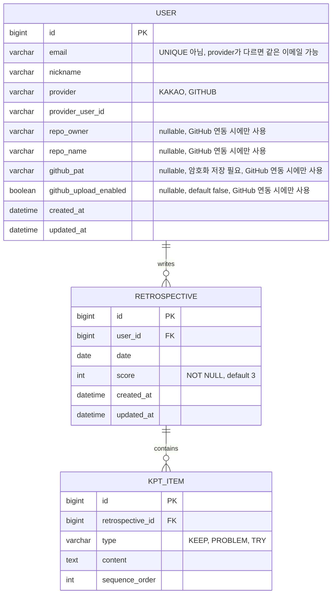
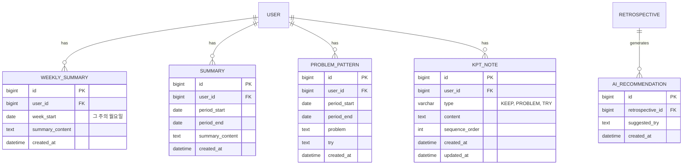

# ERD 

## 전체 요약
* **User**
  서비스의 사용자 정보를 저장하는 테이블.
  
  로그인 정보(OAuth), 프로필, GitHub 연동 정보(PAT, 저장소 정보) 등을 함께 관리한다.

* **Retrospective**
  하루에 하나씩 작성하는 회고를 저장하는 테이블.
  
  날짜와 점수를 관리하며, 하나의 회고는 여러 개의 KPT 항목과 AI 추천을 가질 수 있다.

* **KptItem**
  하나의 회고에 포함되는 Keep, Problem, Try 항목을 저장하는 테이블. 
  
  여러 개의 KPT를 작성하고, 순서 변경 및 개별 수정이 가능하도록 분리하였다.

* **AiRecommendation**
  AI가 생성한 Try 추천 결과를 저장하는 테이블.
  
  추천 히스토리를 보존하기 위해 회고와 1:N 관계로 관리한다.

* **WeeklySummary**
  특정 주의 회고를 기반으로 생성된 주간 요약을 저장하는 테이블.
  
  홈 화면의 '이번 주 요약' 및 과거 주 요약 조회에 사용된다.

* **ProblemPattern**
  사용자가 선택한 기간의 회고를 분석하여 반복되는 문제와 추천 행동을 저장하는 테이블.
  
  AI 기반 패턴 분석 결과를 보관한다.

* **Summary**
  사용자가 선택한 기간의 회고를 하나의 자연어 요약으로 저장하는 테이블.
  
  통계 화면에서 기간별 회고 요약을 제공하기 위해 사용한다.

* **KptNote**
  특정 날짜의 회고와는 별개로 Keep, Problem, Try 메모를 지속적으로 관리하는 테이블.
  
  분석 과정에서 떠오른 아이디어나 메모를 날짜와 무관하게 누적하여 저장한다.

---

**기본(MVP)** 스키마와 **확장(Advanced/Extension)** 스키마를 나눠서 정리.

## 1. 기본 (MVP)

회원가입/로그인, OAuth, 회고 CRUD, 캘린더 시각화, GitHub 연동 설정.

회고 CRUD만 놓고 보면 User, Retrospective 두 테이블이 가장 먼저 필요함. 여기서부터 하나씩 살을 붙여감.

### 1-1. User

#### 1. 로그인 방식

서비스는 **카카오 로그인**과 **GitHub 로그인**만 지원한다.

* 일반 회원가입은 지원하지 않는다.
    -> 일반 로그인에만 필요한 password 컬럼 제거 
* 최초 소셜 로그인 시 자동으로 회원가입된다.
* 카카오 로그인과 GitHub 로그인은 서로 독립적인 로그인 방식이다.
    * 즉, 동일한 사람이 카카오와 GitHub로 각각 로그인하더라도 **계정을 병합하지 않고 서로 다른 사용자로 취급**한다.

#### 2. OAuth 정보 저장 방식

처음에는 `User`와 `OAuthAccount`를 분리하여 **User : OAuthAccount = 1:N** 구조를 고려하였다. 이는 하나의 사용자가 카카오와 GitHub 계정을 모두 연동하는 경우를 지원하기 위한 구조였다.

하지만 최종 정책은 **카카오 로그인과 GitHub 로그인을 서로 다른 사용자로 취급**하는 것이다. 소셜 계정 연동은 계정 병합과 중복 처리 등 추가적인 로직이 필요하지만, 서비스 규모와 요구사항을 고려했을 때 실익이 크지 않다고 판단하였다. 따라서 카카오와 GitHub 계정은 각각 독립적인 사용자로 관리하도록 설계하였다.

즉, 동일한 사람이 두 소셜 계정으로 로그인하더라도 각각 독립적인 사용자로 생성하며, 계정을 병합하지 않는다.

또한 GitHub 자동 커밋 기능도 OAuth가 아닌 PAT를 사용하도록 변경하면서, 여러 OAuth 계정을 관리해야 할 이유가 사라졌다.

따라서 `OAuthAccount` 테이블을 제거하고, `provider`와 `provider_user_id`를 `User` 테이블에 직접 저장하는 구조로 변경하였다.

#### 3. GitHub 자동 커밋

GitHub 자동 커밋은 **OAuth**와 **PAT(Personal Access Token)** 두 가지 방식으로 구현할 수 있다.

**OAuth 방식**

GitHub 로그인 후 발급받은 `access_token`을 저장하여 이후 GitHub API를 호출하는 방식이다.

장점: 사용자가 별도의 토큰을 발급할 필요가 없다

단점: OAuth 토큰의 권한(scope), 만료 및 갱신 등을 관리해야 한다.

**PAT 방식**

사용자가 GitHub에서 직접 발급한 PAT를 설정 화면에 입력하고, 서버는 이를 이용해 GitHub API를 호출하는 방식이다.

장점: OAuth 토큰을 관리할 필요가 없어 구현이 단순하며, 카카오 로그인 사용자와 GitHub 로그인 사용자 모두 동일한 방식으로 GitHub 연동을 사용할 수 있다.

**최종 결정**

자동 커밋은 **PAT 방식**을 사용하기로 결정하였다.

이에 따라

* OAuth 토큰은 로그인 시 사용자 정보 조회에만 사용하고 저장하지 않는다.
* `access_token` 컬럼은 제거하였다.
* `github_pat`을 `User` 테이블에 저장한다.
* `repo_owner`, `repo_name`도 GitHub 연동 설정의 일부이므로 함께 `User` 테이블에 저장한다.
* `github_upload_enabled`는 PAT/repo가 등록되어 있어도 사용자가 자동 커밋 기능 자체를 켜고 끌 수 있어야 해서 별도로 둔 boolean 값이다 (연동 정보는 있지만 자동 커밋은 끄고 싶은 경우를 위함).

즉, GitHub 로그인을 하더라도 자동 커밋을 사용하려면 별도로 PAT를 등록해야 한다.

#### 4. 이메일 제약 조건

처음에는 `email`에 UNIQUE 제약을 둘 계획이었다.

하지만 카카오 로그인과 GitHub 로그인을 서로 다른 사용자로 취급하기로 결정하면서 동일한 이메일을 사용하는 경우도 허용해야 한다.

따라서 `email`의 UNIQUE 제약은 제거하였다.

대신 실제 중복을 방지해야 하는 기준인 `(provider, provider_user_id)`에 UNIQUE 제약을 적용하여 동일한 소셜 계정으로 중복 가입되는 것만 방지한다.

### 변경 사항 요약

* 일반 회원가입을 제거하면서 `password` 컬럼을 삭제하였다.
* GitHub 로그인과 카카오 로그인은 병합하지 않고 서로 다른 사용자로 취급하기로 결정하였다.
* 이에 따라 `OAuthAccount` 테이블을 제거하고 `provider`, `provider_user_id`를 `User` 테이블로 통합하였다.
* GitHub 자동 커밋은 OAuth 대신 PAT 방식을 채택하였다.
* `access_token` 컬럼을 제거하고 `github_pat`, `repo_owner`, `repo_name`을 `User` 테이블에 추가하였다.
* `email`의 UNIQUE 제약을 제거하고 `(provider, provider_user_id)`에 UNIQUE 제약을 적용하였다.

---

### 1-2. Retrospective, KptItem

#### 1. 회고 저장 구조

처음에는 `Retrospective` 테이블 하나에 `keep`, `problem`, `try`를 각각 텍스트 컬럼으로 저장하는 구조를 고려하였다.

또한 `score`, `user_id`, `date`를 함께 저장하면 회고 기능을 구현하기에 충분하다고 판단하였다.

#### 2. 하루 하나의 회고

캘린더는 날짜별로 회고 작성 여부를 표시한다.

따라서 같은 사용자가 같은 날짜에 여러 개의 회고를 작성할 수 있으면 어떤 회고를 표시해야 하는지 모호해지고, 캘린더 로직도 복잡해진다.

이를 방지하기 위해 `Retrospective`에 `(user_id, date)` 복합 UNIQUE 제약을 적용하였다.

`date`만 UNIQUE로 설정하면 다른 사용자도 같은 날짜에 회고를 작성하지 못하게 되므로 반드시 `user_id`와 함께 제약을 적용한다.

#### 3. KPT 저장 방식

처음에는 `keep`, `problem`, `try`를 각각 하나의 텍스트 컬럼으로 저장하는 방식을 고려하였다.

하지만 상세 기획을 진행하면서 다음과 같은 요구사항이 추가되었다.

* Keep / Problem / Try 각각 최대 20개 작성 가능
* 항목별 개별 수정 가능
* 드래그로 순서 변경 가능

텍스트 컬럼 하나로는 **여러 개의 항목**, **순서**, **개별 수정**을 표현하기 어렵다고 판단하였다.

최종적으로 `Retrospective : KptItem = 1:N` 구조로 분리하였다.

**type 컬럼**

Keep, Problem, Try를 각각 별도의 컬럼으로 두지 않고 `type` 컬럼으로 구분한다.

즉 하나의 `KptItem`은

* KEEP
* PROBLEM
* TRY

중 하나의 값을 가지며, 하나의 테이블에서 세 종류를 모두 관리한다.

**sequence_order**

드래그로 순서를 변경할 수 있도록 `sequence_order` 컬럼을 추가하였다.

화면에 표시되는 `K1`, `K2`와 같은 번호는 저장하지 않고, `sequence_order`를 기준으로 계산하여 표시한다.

따라서 드래그로 순서가 변경되면 번호도 자동으로 변경된다.

**최대 개수 제한**

Keep, Problem, Try는 각각 최대 20개까지 작성할 수 있다.

프론트엔드에서는 동일한 type의 KPT가 20개가 되면 추가 버튼을 비활성화하여 더 이상 입력할 수 없도록 한다. 다만 클라이언트 검증만으로는 우회가 가능하므로, 서버에서도 저장 전에 현재 개수를 확인하여 20개를 초과하는 요청은 거부한다

따라서 새로운 KPT를 저장할 때는 해당 회고에 같은 type의 KPT가 현재 몇 개 저장되어 있는지 먼저 확인해야 한다. 예를 들어 Keep이 이미 20개 저장되어 있다면 21번째 Keep은 저장을 허용하면 안 되고, Problem과 Try도 각각 동일한 규칙을 적용해야 한다.

이러한 규칙은 하나의 행만 검사해서 판단할 수 있는 것이 아니라, 같은 retrospective_id와 type을 가진 모든 행의 개수를 조회한 뒤 그 결과를 기준으로 저장 가능 여부를 결정해야 한다. 일반적인 DB 제약(UNIQUE, NOT NULL, CHECK 등)은 컬럼 값의 중복 여부나 NULL 여부처럼 행 자체의 값은 검증할 수 있지만, "같은 조건을 만족하는 행이 20개를 넘는지"처럼 여러 행을 집계(COUNT)해서 검사하는 규칙은 표현하기 어렵다.

따라서 저장 요청이 들어오면 서버(Service)에서 먼저 해당 회고와 type에 해당하는 KPT의 개수를 조회하고, 이미 20개 이상인 경우에는 저장을 거부하도록 구현해야 한다.

**빈 항목 저장**

화면에는 빈 입력창이 존재할 수 있지만, `content`가 비어 있는 항목은 DB에 저장하지 않는다.

#### 4. 점수(score)

처음에는 `score`를 nullable로 고려하였다.

하지만 null인 경우 캘린더에서 색을 나타내기 애매해지기 때문에 기본 점수를 중간값인 **3점**으로 결정하였다.

이에 따라 `score`는

* `NOT NULL`
* `DEFAULT 3`

으로 변경하였다.

항상 값이 존재하므로 평균 점수 계산 등에서 별도의 null 처리가 필요 없다.

#### 제약 조건

* `USER` : `UNIQUE(provider, provider_user_id)`
* `RETROSPECTIVE` : `UNIQUE(user_id, date)`
* `KPT_ITEM` : type별 최대 20개 (서버 검증, DB 제약 아님)

#### 정책

회고 작성 및 수정은 **오늘 기준 최근 14일 이내의 날짜**에서만 가능하다.

* 미래 날짜는 작성 및 수정할 수 없다.
* 14일 이전의 날짜는 읽기만 가능하다.
* 삭제는 기간 제한 없이 언제든 가능하다.

세부 API 정책은 `docs/api.md`를 따른다.

### 변경 사항 요약

* `Retrospective` 하나에 `keep`, `problem`, `try` 텍스트 컬럼을 저장하는 구조를 고려하였다.
* 캘린더 정책에 맞춰 `(user_id, date)` 복합 UNIQUE 제약을 추가하여 사용자당 하루 하나의 회고만 작성할 수 있도록 하였다.
* KPT가 여러 개의 항목과 순서를 가져야 하므로 `KptItem` 테이블로 분리하였다.
* `type` 컬럼으로 KEEP / PROBLEM / TRY를 구분하도록 변경하였다.
* `sequence_order`를 추가하여 드래그 순서를 저장하도록 하였다.
* K1, K2와 같은 번호는 저장하지 않고 `sequence_order`를 기반으로 계산하여 표시하도록 하였다.
* type별 최대 20개 제한은 DB가 아닌 서버에서 검증하도록 하였다.
* 빈 `content`는 저장하지 않도록 결정하였다.
* `score`를 `NOT NULL DEFAULT 3`으로 변경하였다.

## Diagram

**제약조건**: `USER`에 `UNIQUE(provider, provider_user_id)`. `RETROSPECTIVE`에 `UNIQUE(user_id, date)`. `KPT_ITEM`은 `type`별 최대 20개(서버 검증, DB 제약 아님).

**정책 (구현 시 API에서 검증)**: 회고 작성/수정은 오늘 기준 최근 14일 이내 날짜만 가능(미래 포함 그 외 날짜는 거부), 단 삭제는 기간 제한 없이 항상 가능. 자세한 내용은 docs/api.md 참고.

---

## 2. 확장 (Advanced / Extension)

AI 추천, 반복 문제 분석, 주간/기간 요약. (Tag는 제외, GitHub 연동 설정은 §1-1 User로 통합 — 아래 참고)

### 2-1. AiRecommendation

#### 1. 추천 저장 구조

처음에는 AI 추천 결과를 `Retrospective` 테이블의 nullable 컬럼 하나에 저장하는 구조를 고려하였다.

하지만 기획을 구체화하면서 사용자가 **'다시 추천'** 기능을 통해 새로운 추천을 여러 번 받을 수 있고, 이전 추천도 다시 확인할 수 있어야 한다는 요구사항이 생겼다.

컬럼 하나만 사용할 경우 새로운 추천을 받을 때마다 기존 추천이 덮어써져 히스토리가 사라진다.

따라서 `Retrospective : AiRecommendation = 1:N` 구조로 분리하였다.

#### 2. 추천 순서 관리

처음에는 추천이 몇 번째 생성되었는지 구분하기 위해 별도의 순서 컬럼을 고려하였다.

하지만 추천은 수정되지 않는 이력성 데이터이므로 `created_at`만으로 생성 순서를 판단할 수 있다.

따라서 별도의 순서 컬럼은 추가하지 않았으며, `updated_at`도 두지 않기로 하였다.

#### 3. 최종 구조

추천 결과는 여러 번 생성될 수 있으므로 Retrospective의 컬럼 하나로는 이전 추천을 보존할 수 없다. 따라서 추천 하나를 하나의 레코드로 저장하는 AiRecommendation 테이블을 별도로 두어 히스토리를 관리하도록 하였다.

#### 4. 추천 추가 정책

추천 결과 중 하나를 **Try에 추가**하더라도 기존 추천 히스토리는 삭제하지 않는다.

선택되지 않은 추천도 그대로 유지하여 이후에도 다시 확인할 수 있도록 한다.

또한 사용자당 하루 추천 횟수를 제한하기 때문에 회고 하나에 저장되는 추천 수도 최대 30개(10회 × 3개) 수준이며, 텍스트 데이터만 저장하므로 저장 비용도 크지 않다고 판단하였다.

#### 5. 남용 방지

AI 추천은 외부 AI API를 호출하므로 비용이 발생하며, 추천 히스토리도 계속 누적된다.

따라서 **사용자당 하루 10회**로 추천 횟수를 제한하였다.

* AI 추천은 회고별이 아닌 사용자별로 하루 최대 10회까지 사용할 수 있다
* 추천 횟수는 매일 KST(Korea Standard Time) 자정에 초기화된다.

### 변경 사항 요약

* AI 추천을 `Retrospective`의 컬럼 하나에 저장하는 구조를 고려하였다.
* 추천 히스토리를 보존하기 위해 `Retrospective : AiRecommendation = 1:N` 구조로 변경하였다.
* 별도의 순서 컬럼 대신 `created_at`으로 추천 순서를 관리하도록 변경하였다.
* Try에 추천을 추가해도 기존 추천 히스토리는 유지하도록 결정하였다.
* AI 추천은 사용자당 하루 10회(KST 기준)로 제한하도록 결정하였다.

---

### 2-2. WeeklySummary (홈/캘린더 화면 전용)

#### 1. 주간 요약과 회고의 관계

주간 요약은 여러 개의 회고를 기반으로 생성된다.

처음에는 주간 요약에 **포함된 모든 회고의 ID를 저장**하는 방식을 고려하였다.

하지만 다음 두 가지 방식을 비교하였다.

1. 포함된 회고 ID를 모두 저장한다.
2. `user_id`와 `week_start`만 저장하고, 필요할 때 해당 주의 회고를 날짜 범위로 조회한다.

최종적으로 두 번째 방식을 선택하였다.

이 방식은 구조가 단순하며, 회고가 수정되거나 삭제되더라도 주간 요약과의 관계가 깨지지 않는다.

#### 2. 기간 정보

처음에는 `week_end` 컬럼도 저장하는 것을 고려하였다.

하지만 주간 요약은 항상 월요일부터 일요일까지 7일이라는 고정된 기간을 사용한다.

따라서 종료일은 `week_start + 6일`로 계산할 수 있으므로 `week_end` 컬럼은 추가하지 않았다.

계산 가능한 값은 저장하지 않는다는 원칙을 적용하였다.

#### 3. 이번 주 요약

이 테이블은 **홈 화면의 '이번 주 요약'** 기능을 위한 테이블이다.

기간은 항상 **월요일 시작**으로 고정하며, 같은 주에 다시 요약을 생성하면 기존 데이터를 덮어쓴다. 하루에 최대 3번 다시 요약 가능하다.

이를 위해 `(user_id, week_start)`에 UNIQUE 제약을 적용한다.

사용자가 임의의 기간을 선택하여 조회하는 요약은 별도의 `Summary` 기능으로 분리하였다.

#### 4. 과거 주 조회

처음에는 현재 주의 요약만 제공하는 구조를 고려하였다.

하지만 이 경우

* 월요일에는 아직 회고가 없어 요약이 비어 있을 수 있고,
* 이전 주의 요약을 다시 확인할 수 없다는 문제가 있었다.

조회 시점을 기준으로 최근 7일을 요약하는 방식(롤링 7일)도 검토하였다. 그러나 하루가 지날 때마다 요약 기간이 계속 바뀌기 때문에 주별 변화나 이전 주와의 비교가 어렵다고 판단하여 적용하지 않았다.

최종적으로는 **이번 주 기준은 유지하면서, 캘린더에서 이전 주를 넘겨볼 수 있도록** 하였다.

사용자가 조회한 주의 요약이 아직 생성되지 않았다면 해당 시점에 생성하여 저장하고, 이미 존재하면 저장된 데이터를 그대로 사용한다.

미래 주는 요약 대상에서 제외한다.

단, "다시 요약하기"로 강제 재생성하는 것은 이번 주에서만 가능하며, 지난 주는 조회(및 없을 시 최초 생성)만 가능하다.

### 변경 사항 요약

* 주간 요약에 회고 ID 목록을 저장하는 대신 `user_id`와 `week_start`만 저장하도록 변경하였다.
* `week_end`는 계산 가능한 값이므로 제거하였다.
* 홈 화면의 "이번 주 요약" 전용 테이블로 사용하며 `(user_id, week_start)`에 UNIQUE 제약을 적용하였다.
* 과거 주를 넘겨볼 수 있는 기능을 추가하고, 요약이 없으면 조회 시 생성하도록 변경하였다.
* `week_start`의 기본값은 API가 아닌 프론트엔드에서 계산하여 전달하도록 결정하였다.

---

### 2-3. ProblemPattern

#### 1. ProblemPattern 구조

`ProblemPattern`은 여러 회고를 분석하여 **반복적으로 나타나는 문제와 이에 대한 추천 행동**을 저장하기 위한 테이블이다.

처음에는 분석 결과를 하나의 `contents` 컬럼에 저장하는 것도 고려하였다.

하지만 화면에서 **'반복된 문제'**와 **'추천 행동'**을 각각 구분하여 표시해야 하므로, 하나의 컬럼으로 저장하면 화면 구성과 데이터 의미가 모호해질 수 있었다.

따라서 `problem`과 `try`를 별도의 컬럼으로 분리하였으며, `Retrospective`의 KPT 구조와 컬럼명을 일관되게 유지하였다.

#### 2. Tag 기능 대체

초기에는 태그를 이용해 비슷한 회고를 묶는 기능을 고려하였다.

하지만 태그 기능을 제거하면서, **여러 회고를 분석하여 반복되는 문제를 찾는 역할**은 `ProblemPattern`이 담당하도록 변경하였다.

사용자가 직접 태그를 관리하는 대신 AI가 회고 내용을 분석하여 반복 패턴을 제공하도록 설계하였다.

#### 3. 기간 관리

처음에는 `WeeklySummary`와 동일하게 **기간별 데이터를 하나만 저장**하는 구조를 고려하였다.

하지만 `ProblemPattern`은 통계 화면에서 사용자가 원하는 기간을 직접 선택하여 분석하는 기능이므로, 기간이 항상 고정될 수 없었다.

따라서 사용자가 `period_start`와 `period_end`를 직접 선택하도록 변경하였다.

#### 4. 저장 방식

처음에는 `WeeklySummary`처럼 같은 기간의 분석을 다시 생성하면 기존 데이터를 덮어쓰는 구조를 고려하였다.

하지만 사용자가 같은 기간을 여러 번 분석하거나, 서로 다른 분석 결과를 비교하며 보관하고 싶을 수도 있다고 판단하였다.

또한 분석을 요청할 때마다 자동으로 저장하면 불필요한 데이터가 계속 쌓일 수 있다.

따라서 **분석 결과는 먼저 미리보기만 제공하고 DB에는 저장하지 않으며, 사용자가 '저장'을 선택한 경우에만 저장**하도록 변경하였다.

이와 함께 같은 기간의 데이터를 여러 개 저장할 수 있도록 `UNIQUE(user_id, period_start)` 제약은 제거하였으며, 각 분석 결과는 `id`로 구분하여 개별 삭제할 수 있도록 하였다.

### 변경 사항 요약

* 분석 결과를 하나의 컬럼이 아닌 `problem`과 `try` 컬럼으로 분리하였다.
* 태그 기능을 제거하면서 반복 패턴 분석 역할을 `ProblemPattern`이 담당하도록 변경하였다.
* 고정 기간 대신 사용자가 원하는 기간을 직접 선택하여 분석하도록 변경하였다.
* 자동 저장 대신 **미리보기 후 저장** 방식으로 변경하였다.
* 같은 기간의 분석 결과를 여러 개 저장할 수 있도록 UNIQUE 제약을 제거하였다.
* 통계 화면의 자유 기간 요약 기능을 위해 `Summary` 테이블을 별도로 분리하였다.

---

### 2-4. KptNote (캘린더 화면 전용)

날짜/회고에 묶이지 않고 독립적으로 쌓이는 Keep/Problem/Try 메모. KPT 작성 화면과 분석 탭 양쪽에서 추가할 수 있지만 같은 테이블/API를 공유함. AI는 관여하지 않는 순수 사용자 메모라 §2-4 ProblemPattern(AI 분석)과는 완전히 별개 기능.

`KptItem`과 이름은 비슷하지만 관계가 다름 — `KptItem`은 `Retrospective(1) : KptItem(N)`으로 특정 날짜 회고에 종속되는 반면, `KptNote`는 `User(1) : KptNote(N)`으로 날짜와 무관하게 계속 누적됨. 그래서 `retrospective_id` 대신 `user_id`를 직접 참조.

`type`(KEEP/PROBLEM/TRY), `sequence_order`(드래그 순서), type별 최대 20개(서버 검증) 등 나머지 정책은 `KptItem`과 동일하게 맞춤.

---

### 2-5. Template (스키마에서 제외)

#### 1. 회고 템플릿 기능 검토

처음에는 사용자가 **KPT뿐만 아니라 4F, Start/Stop/Continue 등 다양한 회고 템플릿을 선택하거나, 직접 템플릿을 만들어 사용할 수 있는 기능**을 고려하였다.

이 기능을 지원하려면 템플릿 정보를 저장하는 `Template` 테이블이 필요하며, 사용자 정의 템플릿까지 지원하는 경우 `User : Template = 1:N` 관계를 갖도록 설계할 계획이었다.

#### 2. 스키마에서 제외

하지만 현재 서비스에서는 **KPT만 회고 방식으로 사용**하며, 다른 템플릿을 선택하거나 사용자 정의 템플릿을 생성하는 기능은 제공하지 않는다.

따라서 현재 시점에서는 템플릿 정보를 DB에 저장할 필요가 없다고 판단하였다.

향후 다양한 회고 방식을 지원하거나 사용자가 직접 템플릿을 생성·관리하는 기능이 추가될 경우 `Template` 테이블을 도입할 예정이다.

### 변경 사항 요약

* KPT 외에 4F, Start/Stop/Continue 등 다양한 회고 템플릿 지원을 검토하였다.
* 사용자 정의 템플릿 기능을 고려하여 `Template` 테이블을 설계할 계획이었다.
* 현재는 KPT만 지원하므로 `Template` 테이블을 스키마에서 제외하였다.

---

### 2-6. Tag (스키마에서 제외)

#### 1. Tag 관련 ERD 설계 과정 및 최종 결정

처음에는 `Tag`와 `Retrospective`의 관계를 **1:N**으로 고려하였다.

하지만 요구사항을 다시 검토하면서 다음 두 조건을 모두 만족해야 한다는 점을 확인하였다.

* 하나의 회고에는 여러 개의 태그를 붙일 수 있어야 한다.
* 하나의 태그는 여러 회고에서 재사용될 수 있어야 한다.

따라서 `Tag`와 `Retrospective`의 관계는 **N:M**이 적절하다고 판단하였다.

#### 2. N:M 관계 표현

RDB에서는 N:M 관계를 두 개의 테이블만으로 직접 표현할 수 없다.

따라서 `RETROSPECTIVE_TAG` 조인 테이블을 추가하여 관계를 표현하는 구조를 고려하였다.

`RETROSPECTIVE_TAG`는 `retrospective_id`와 `tag_id`를 복합 PK로 사용하여 동일한 태그가 같은 회고에 중복 연결되는 것을 방지하도록 설계하였다.

또한 `TAG` 테이블에는 사용자별로 같은 이름의 태그가 중복 생성되지 않도록 `(user_id, name)`에 UNIQUE 제약을 둘 계획이었다.

#### 3. 최종 결정

최종적으로는 **Tag 기능 자체를 스키마에서 제외**하였다.

그 이유는 다음과 같다.

* 매일 작성하는 짧은 회고에 태그를 직접 입력하게 하면 작성 과정의 부담이 증가한다.
* 회고는 이미 캘린더를 통해 날짜별 탐색이 가능하므로 태그 기반 검색의 필요성이 크지 않다.
* 태그의 주요 목적은 비슷한 회고를 묶어 패턴을 확인하는 것인데, 이 기능은 AI 기반 Problem Pattern 분석이 대신 수행할 수 있다.
* 사람이 직접 태그를 일관성 있게 관리하는 것보다 AI가 회고 내용을 기반으로 자동 분석하는 방식이 사용자 경험 측면에서 더 적합하다고 판단하였다.

따라서 `TAG`와 `RETROSPECTIVE_TAG` 테이블은 모두 제거하였다.

### 변경 사항 요약

* `Tag`와 `Retrospective`를 처음에는 1:N 관계로 고려하였다.
* 하나의 회고에 여러 태그, 하나의 태그를 여러 회고에서 사용할 수 있어야 하므로 N:M 관계로 변경하였다.
* 이를 위해 `RETROSPECTIVE_TAG` 조인 테이블과 `TAG` 테이블을 설계하였다.
* 태그 기능이 AI 기반 Problem Pattern 분석과 역할이 겹친다고 판단하여 최종적으로 `TAG`와 `RETROSPECTIVE_TAG` 테이블을 모두 제거하였다.

---

### Diagram

**제약조건**: `WEEKLY_SUMMARY`에 `UNIQUE(user_id, week_start)` (같은 주는 하나만 유지). `SUMMARY`, `PROBLEM_PATTERN`, `KPT_NOTE`는 별도 UNIQUE 없음(같은 기간을 여러 번 저장 가능, 개별 `id`로 구분/삭제). `KPT_NOTE`도 `type`별 최대 20개(서버 검증, DB 제약 아님).

(TAG, RETROSPECTIVE_TAG, GITHUB_INTEGRATION은 위 결정에 따라 다이어그램에서 제외됨. GitHub 연동 컬럼은 §1-1의 USER 테이블 정의 참고.)
