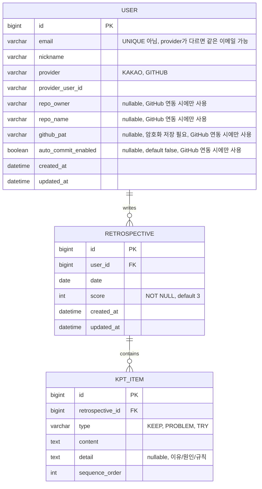
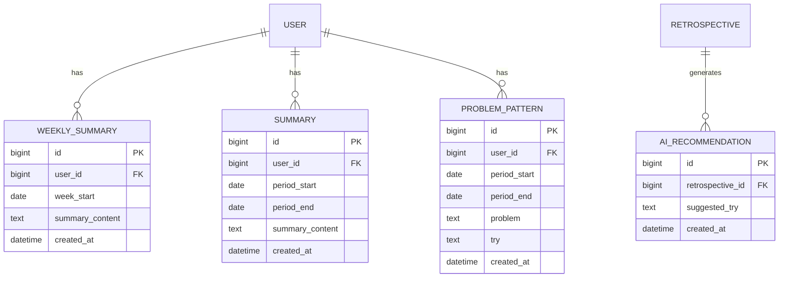

# ERD (Retrospective AI)

README 로드맵 기준으로, **기본(MVP)** 스키마와 **확장(Advanced/Extension)** 스키마를 나눠서 정리.

---

## 1. 기본 (MVP)

회원가입/로그인, OAuth, 회고 CRUD, 캘린더 시각화, GitHub 연동 설정.

### 1-1. User

회고 CRUD만 놓고 보면 User, Retrospective 두 테이블이 가장 먼저 필요함. 여기서부터 하나씩 살을 붙여감.

처음엔 "User 테이블에 `provider`, `provider_id` 컬럼만 추가해서 카카오인지 깃허브인지 저장하면 되지 않나" 싶었음. 근데 README엔 카카오 로그인 + GitHub OAuth(자동 커밋용)가 둘 다 있는데, **카카오로 가입한 사용자가 나중에 GitHub 계정도 연동하면** User 한 행에 provider 컬럼 하나로는 두 개를 동시에 저장할 수가 없음. → `User : OAuthAccount = 1:N`으로 분리해서, 한 사용자가 여러 provider 계정을 가질 수 있게 함.

**최종 결정 (로그인 방식 - 소셜 로그인 전용)**: 처음엔 일반 회원가입(이메일+비밀번호)도 지원하는 걸 전제로 `User.password`(nullable, OAuth 전용 가입자는 null) 컬럼을 뒀었음. 근데 실제로는 카카오/GitHub 소셜 로그인만 지원하기로 결정 — 일반 회원가입 자체가 없으니 비밀번호를 저장할 이유가 없어짐. → `password` 컬럼 제거.

**최종 결정 (GitHub 로그인 vs 연동은 별개)**: GitHub는 카카오와 마찬가지로 독립적인 로그인 버튼으로도 쓰임. 이 경우 "카카오로 가입한 사람이 나중에 GitHub로도 로그인하면 같은 사람인데 계정이 두 개로 쪼개지는" 문제가 있는데, 이메일 매칭 등으로 자동 병합하는 로직은 넣지 않고 **그냥 별개 계정으로 취급**하기로 함 (병합 로직의 복잡도 대비 실익이 적다고 판단).

OAuthAccount의 처음 생각한 컬럼은 provider, provider_user_id 두 개뿐이었고, 이건 "로그인 확인"까지만 가능함. 근데 GitHub 자동 커밋 기능은 로그인 확인으로 끝나는 게 아니라, 우리 서버가 사용자 대신 GitHub API를 호출(커밋)해야 함. 그러려면 인증 후 발급받은 `access_token`을 저장해둬야 API 호출이 가능하다고 보고 한때 컬럼을 추가했었음.

**최종 결정 (GitHub 연동은 OAuth access_token이 아니라 PAT)**: API 설계 단계에서 GitHub 자동 커밋 흐름을 다시 짜면서, OAuth로 받은 access_token 대신 **사용자가 GitHub에서 직접 발급한 PAT(Personal Access Token)를 설정 화면에서 입력받아 저장**하는 방식으로 바꿈. PAT 쪽이 OAuth 스코프/토큰 갱신을 신경 쓸 필요 없이 훨씬 단순하기 때문. 이 결정에 따라:
- `OAuthAccount.access_token` 컬럼은 완전히 제거함 — 로그인 시점에 프로필(고유 ID 등) 조회용으로 잠깐 쓰고 버리면 되고, 어떤 provider도 이 값을 이후에 다시 쓸 일이 없어짐 (Kakao는 애초에 필요 없었고, GitHub 자동 커밋은 이제 PAT가 담당).
- 대신 `User`에 `github_pat` 컬럼을 추가함 (repo_owner/repo_name과 함께 GitHub 연동 설정의 일부이므로 같은 테이블에 둠. 이유는 §2-5 참고).

**최종 결정 (OAuthAccount를 없애고 User에 통합)**: 애초에 `OAuthAccount`를 1:N으로 분리했던 이유는 "같은 유저가 카카오 + GitHub를 동시에 연동할 수 있어야 한다"는 것이었음. 근데 그 뒤 (1) provider 간 계정 병합을 안 하기로 했고(위 결정), (2) GitHub 자동 커밋도 OAuth가 아니라 PAT로 바뀌면서, **한 유저가 동시에 여러 provider를 가지는 시나리오 자체가 없어짐** — 유저는 평생 정확히 하나의 `(provider, provider_user_id)`만 가짐. 1:N으로 분리해뒀던 이유가 사라졌으므로, `OAuthAccount` 테이블을 없애고 `provider`, `provider_user_id`를 `User`에 직접 컬럼으로 추가함.

이 변경에 따라 `email`의 `UNIQUE` 제약도 제거함 — 카카오 계정과 GitHub 계정이 같은 이메일을 쓰더라도 서로 다른 유저로 취급하기로 했으므로, `email`을 전역 유니크로 걸면 이 경우 두 번째 로그인이 실패해버림. 대신 실제 중복 방지가 필요한 지점인 `(provider, provider_user_id)`에 `UNIQUE`를 걸어서, 같은 provider 계정으로 중복 가입되는 것만 막음.

### 1-2. Retrospective, KptItem

처음엔 KPT(keep/problem/try), score, user_id, date로 `Retrospective` 하나에 텍스트 컬럼 세 개(keep/problem/try)로 충분하다고 생각함.

캘린더가 날짜 단위로 작성 여부를 보여주기 때문에, 같은 유저가 같은 날짜에 회고를 두 개 쓸 수 있으면 캘린더 표시 로직이 꼬임. → `UNIQUE(user_id, date)` 복합 유니크로 DB 레벨에서 차단. (`date` 컬럼 단독으로 유니크를 걸면 다른 유저까지 같은 날짜에 못 쓰게 되므로 반드시 `user_id`와 묶어야 함)

**최종 결정 (KPT를 텍스트 컬럼에서 KptItem 테이블로 분리)**: 상세 기획을 다시 짜면서, Keep/Problem/Try 각각이 "내용 + 이유" 쌍을 가진 항목을 최대 20개까지 가질 수 있고, 드래그로 순서를 바꿀 수 있어야 한다는 요구사항이 나옴. 텍스트 컬럼 하나로는 "여러 개의, 순서가 있는, 개별 수정 가능한 항목"을 표현할 수 없어서 (Tag/AiRecommendation을 분리했던 것과 같은 이유), `Retrospective : KptItem = 1:N`으로 분리함.

- `type`(KEEP/PROBLEM/TRY)으로 세 종류를 한 테이블에서 구분 — Retrospective에 keep/problem/try 세 컬럼을 각각 두는 대신, type 컬럼 하나로 묶어서 "항목 하나"라는 개념을 통일함.
- 두 번째 텍스트 컬럼 이름은 `reason`이 아니라 `detail`로 정함 — Keep은 "이유", Problem은 "원인", Try는 "규칙"으로 의미가 다 달라서, 특정 의미에 치우치지 않는 이름을 선택.
- `sequence_order`로 같은 type 안에서의 순서를 관리. 화면에 보이는 "K1", "K2" 같은 라벨은 이 순서를 기준으로 계산해서 보여줄 뿐, 라벨 자체를 컬럼으로 저장하지 않음 (드래그로 순서가 바뀌면 라벨도 그에 따라 자동으로 바뀌어야 하므로, 라벨을 고정 저장하면 매번 다시 써야 해서 비효율적).
- type별 최대 20개 제한은 서버(Service)에서 저장 전 개수를 세어 검증 — DB 제약으로는 표현하기 어려움.
- `content`/`detail` 둘 다 빈 값인 항목은 저장하지 않기로 함 (화면엔 빈 입력창이 있어도 DB엔 안 남음).

`score`는 원래 nullable이었다가, "기본값 3점"으로 결정되면서 `NOT NULL DEFAULT 3`으로 변경 — 항상 값이 있어서 평균 점수 계산 등에서 null 처리가 필요 없어짐.

### Diagram

**제약조건**: `USER`에 `UNIQUE(provider, provider_user_id)`. `RETROSPECTIVE`에 `UNIQUE(user_id, date)`. `KPT_ITEM`은 `type`별 최대 20개(서버 검증, DB 제약 아님).

**정책 (구현 시 API에서 검증)**: 회고 작성/수정은 오늘 기준 최근 14일 이내 날짜만 가능(미래 포함 그 외 날짜는 거부), 단 삭제는 기간 제한 없이 항상 가능. 자세한 내용은 docs/api.md 참고.

---

## 2. 확장 (Advanced / Extension)

AI 추천, 반복 문제 분석, 주간/기간 요약. (Tag는 제외, GitHub 연동 설정은 §1-1 User로 통합 — 아래 참고)

### 2-1. Tag (스키마에서 제외)

처음엔 Tag ↔ Retrospective 관계를 1:N이라고 생각했다가, "회고 하나에 태그 여러 개 + 같은 태그를 여러 회고에서 재사용" 두 조건을 동시에 만족해야 한다는 걸 짚어보고 N:M으로 정정함. RDB는 N:M 관계를 테이블 두 개만으로 직접 표현할 방법이 없어서, 중간에 양쪽 FK를 가진 `RETROSPECTIVE_TAG` 조인 테이블을 두기로 했었음 (복합 PK로 같은 조합 중복 방지까지 자동으로 처리됨). 유니크 제약은 `UNIQUE(user_id, name)`으로 계획.

**최종 결정: 스키마에서 제외.** 매일 짧게 쓰는 회고에 태그까지 직접 달게 하면 작성 단계 마찰만 늘어나는데, 캘린더로 이미 날짜별 탐색이 가능해서 검색 니즈가 크지 않음. 게다가 태그의 핵심 용도(비슷한 회고를 묶어 패턴을 보는 것)는 §2-4 ProblemPattern이 AI로 자동 처리해주는 것과 역할이 겹침 — 사람이 수동으로 태그를 일관되게 다는 것보다 AI가 내용 기반으로 군집화하는 쪽이 사용자 부담이 적음. → `TAG`, `RETROSPECTIVE_TAG` 테이블 모두 제외.

### 2-2. AiRecommendation

처음엔 Retrospective에 nullable 컬럼 하나로 충분한 줄 알았음. 하지만 "다시 추천해줘"로 재생성이 가능해야 하고, 이전에 받은 추천도 다시 보고 싶을 수 있다는 결론이 나오면서 — 컬럼 하나로는 재생성할 때마다 이전 값을 덮어써서 히스토리가 사라짐을 확인함. → `Retrospective : AiRecommendation = 1:N`으로 분리.

"몇 번째 추천인지" 순서를 매기려고 별도 `순서` 컬럼을 만들려다가, 이미 있는 `created_at`으로 최신순 정렬이 가능하다는 걸 떠올리고 컬럼을 줄임. (수정되지 않는 이력성 데이터라 `updated_at`은 불필요)

**재검토 결과 (분리 유지)**: 히스토리 보존 요구사항 자체가 1:N이라 Retrospective의 컬럼 하나로는 구조적으로 표현이 불가능함(재생성 시 이전 값을 잃음). JSON 배열 컬럼으로 우회하는 대안도 있지만, JPA에서 컬렉션을 JSON으로 다루려면 컨버터가 따로 필요하고 `created_at` 기준 정렬도 불편해져서, User→Retrospective에 이미 쓰는 `@OneToMany` 패턴을 그대로 재사용하는 별도 테이블이 더 단순함. → 분리 유지로 확정.

**추천을 Try 항목으로 "추가"해도 히스토리는 지우지 않음**: 추천 중 하나를 "추가"하면 새 `KptItem`(type=TRY)이 하나 생기는 것뿐이고("추가"는 별도 API 없이 기존 KptItem 생성 API를 그대로 재사용), 선택 안 된 나머지 추천들은 그대로 둠. 하루 생성 제한(10회)이 있어서 회고 하나당 최대 30개(10회 × 3개) 남짓만 쌓이고, 텍스트 몇 줄이라 저장 비용도 무시할 만함 — 그래서 굳이 지울 이유가 없다고 판단.

**남용 방지**: 매번 AI(OpenAI/Google AI Studio API) 호출 비용이 들고 히스토리도 계속 쌓이므로, **유저 한 명당 하루 10회**로 제한하기로 확정함(KST 자정 기준 초기화). 여러 날짜의 회고를 편집해도 합쳐서 10회이지, 특정 회고 단위 제한이 아님.

### 2-3. WeeklySummary (홈/캘린더 화면 전용)

이 요약이 여러 회고를 묶은 결과라, "그 주의 회고를 어떻게 다시 찾을까"를 두 방법으로 비교함 — (A) 포함된 회고 id를 전부 저장 vs (B) `user_id + week_start`만 저장해두고 필요할 때 Retrospective를 날짜 범위로 조회. B가 훨씬 단순하고, 회고가 나중에 수정/삭제돼도 요약 데이터가 깨지지 않아서 B로 결정.

`week_end`는 별도 컬럼으로 안 둠 — 이 테이블은 항상 고정 7일 단위라 `week_start + 6일`로 계산 가능함 (AiRecommendation에서 순서 컬럼을 뺀 것과 같은 이유: 계산 가능한 값은 저장하지 않음).

이 테이블은 **홈 화면 캘린더 상단에 뜨는 "이번 주 요약"** 전용이라 기간이 항상 고정(이번 주 월요일 시작)이고, 재생성하면 기존 값을 덮어씀(`UNIQUE(user_id, week_start)`). 사용자가 기간을 자유롭게 골라보는 요약은 §2-4-1 Summary로 별도 분리함.

기본값 처리: `week_start`를 생략하면 "이번 주 월요일"이 되어야 하는데, 이건 서버 데이터 없이 날짜 계산만으로 프론트가 알 수 있는 값이라 **프론트가 계산해서 항상 명시적으로 채워 보내는 것**으로 정함 (API 자체는 파라미터 생략을 지원할 필요 없음).

### 2-4. ProblemPattern

WeeklySummary랑 구조가 비슷해서 같은 패턴(`user_id` + 기간)을 그대로 적용해봄. 여기에 분석 결과(반복된 문제, 추천 행동)를 담을 컬럼이 필요한데, Retrospective 때 keep/problem/try를 하나로 합치지 않았던 것과 같은 이유로 하나의 `contents` 컬럼 대신 `problem`/`try`로 분리 — 화면에 "반복된 문제"와 "추천 행동"을 따로 표시할 수 있어야 하므로. 컬럼명도 Retrospective의 problem/try와 통일시킴.

Tag를 스키마에서 뺀 이후로는(§2-1), 이 테이블이 "회고들을 묶어 반복 패턴을 찾는" 역할을 사람 개입 없이 전담하게 됨.

**최종 결정 (기간 자유 선택 + 미리보기 후 저장)**: 처음엔 WeeklySummary처럼 "재생성하면 덮어쓰기"(`UNIQUE(user_id, period_start)`)로 계획했었음. 근데 이 기능은 통계 화면에서 사용자가 기간을 자유롭게 골라 분석하는 용도라, 같은 정책을 쓰기 애매함. 그래서 §2-4-1 Summary와 완전히 같은 흐름으로 바꿈:
- 기간(`period_start`, `period_end`)을 사용자가 직접 고름 (고정 길이 아님)
- 생성 버튼을 누르면 일단 미리보기만 하고(DB 저장 안 함), "저장" 버튼을 눌러야 실제로 DB에 남음 — 누를 때마다 자동으로 다 쌓이게 하면 불필요하게 많이 쌓일 것 같아서.
- 같은 기간을 여러 번 저장해도 되므로 `UNIQUE(user_id, period_start)` 제약은 제거. 대신 저장된 항목은 각각 `id`로 구분해서 개별 삭제 가능.

### 2-4-1. Summary (통계 화면 전용, 신규)

WeeklySummary는 홈 화면용으로 "이번 주" 고정이지만, 통계 화면에서는 사용자가 원하는 임의의 기간(예: "최근 10일", "지난달 15일~이번달 15일")을 골라 요약을 보고 싶어함. 이 요구사항은 WeeklySummary의 고정 기간 구조로는 표현이 안 돼서 별도 테이블로 분리.

ProblemPattern(§2-4)과 똑같은 이유로 "미리보기 후 저장" 흐름과 `UNIQUE` 제약 없음을 그대로 적용. keep/problem/try를 따로 요약할지 고민했으나, 화면에는 하나로 자연스럽게 섞은 요약문 하나만 보여주기로 해서 `summary_content` 하나로 유지.

### 2-5. GithubIntegration → User로 통합 (스키마에서 제외)

원래는 `repo_owner`, `repo_name`, `auto_commit_enabled`가 GitHub 전용 정보인데, 공통 인증 테이블인 OAuthAccount에 넣으면 카카오 로그인 행에서는 이 컬럼들이 계속 null로 남는다는 이유로 별도 테이블로 분리했었음 (User/OAuthAccount를 분리했던 것과 같은 논리). "레포를 여러 개 연결할 수도 있지 않나"도 고려했지만, README 로드맵엔 다중 레포 요구사항이 없어서 `User : GithubIntegration = 1:1`로 계획.

**최종 결정: 별도 테이블 제외, User에 컬럼으로 통합.** 애초에 분리했던 이유는 "정규화 원칙상 컬럼이 null로 남는 게 깔끔하지 않아서"였지, "합치면 실제로 문제가 생겨서"가 아니었음. 막상 따져보면: (1) User와 1:1 관계라 부모 테이블에 얹어도 데이터 중복/정합성 문제가 없음 — 1:N이었다면 얘기가 다름, (2) 컬럼이 몇 개 안 돼서 null 비용이 무시할 만한 수준, (3) 다중 레포 계획도 없어서 분리해봐야 이점이 없음. → `repo_owner`, `repo_name`, `github_pat`, `auto_commit_enabled`를 별도 GITHUB_INTEGRATION 테이블 대신 USER 테이블에 직접 추가 (§1-1 다이어그램 참고).

**인증 방식 변경**: 처음엔 이 access_token을 OAuthAccount(provider='GITHUB')의 값을 그대로 참조하는 걸로 정리했었음. 이후 API 설계 단계에서 OAuth 대신 PAT 방식으로 바꾸면서, `access_token` 참조 대신 User에 `github_pat` 컬럼을 직접 추가하는 걸로 변경함 (자세한 이유는 §1-1 참고).

### 2-6. Template (스키마에서 제외)

고정된 힌트 문구만 보여주는 기능이라 프론트엔드 placeholder로 충분하다고 판단 — 지금 시점엔 DB 테이블이 불필요함. (나중에 사용자가 템플릿을 직접 만들어 저장하는 기능으로 발전하면 그때 테이블 추가)

### Diagram

(TAG, RETROSPECTIVE_TAG, GITHUB_INTEGRATION은 위 결정에 따라 다이어그램에서 제외됨. GitHub 연동 컬럼은 §1-1의 USER 테이블 정의 참고.)
