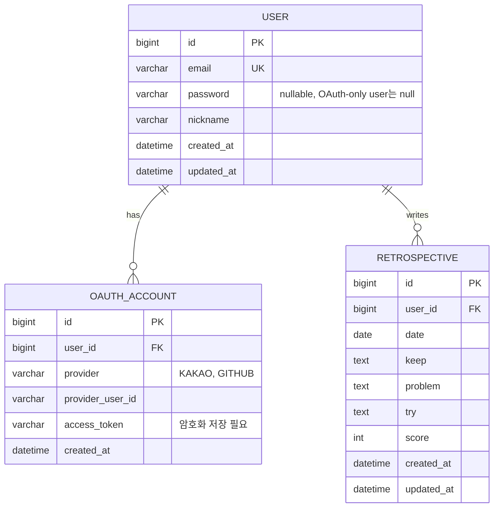
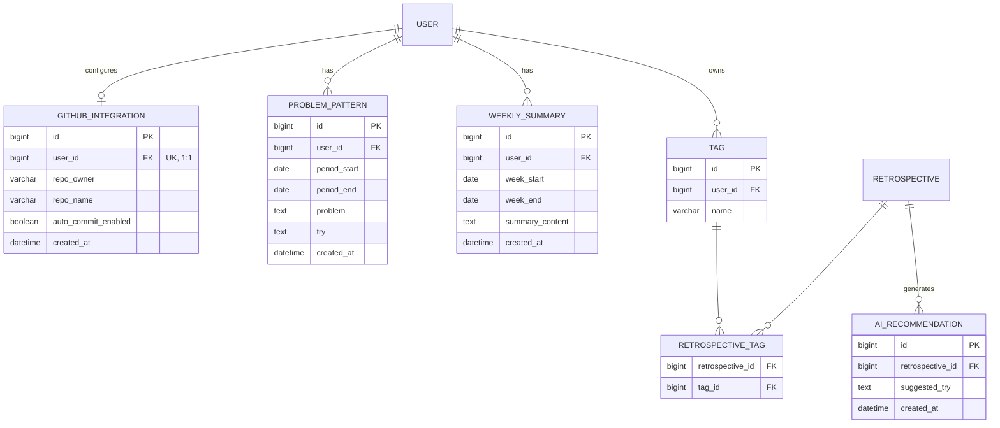

# ERD (Retrospective AI)

README 로드맵 기준으로, **기본(MVP)** 스키마와 **확장(Advanced/Extension)** 스키마를 나눠서 정리.

---

## 1. 기본 (MVP)

회원가입/로그인, OAuth, 회고 CRUD, 캘린더 시각화.

### 1-1. User, OAuthAccount

회고 CRUD만 놓고 보면 User, Retrospective 두 테이블이 가장 먼저 필요함. 여기서부터 하나씩 살을 붙여감.

처음엔 "User 테이블에 `provider`, `provider_id` 컬럼만 추가해서 카카오인지 깃허브인지 저장하면 되지 않나" 싶었음. 근데 README엔 카카오 로그인 + GitHub OAuth(자동 커밋용)가 둘 다 있는데, **카카오로 가입한 사용자가 나중에 GitHub 계정도 연동하면** User 한 행에 provider 컬럼 하나로는 두 개를 동시에 저장할 수가 없음. → `User : OAuthAccount = 1:N`으로 분리해서, 한 사용자가 여러 provider 계정을 가질 수 있게 함.

OAuthAccount의 처음 생각한 컬럼은 provider, provider_user_id 두 개뿐이었고, 이건 "로그인 확인"까지만 가능함. 근데 GitHub 자동 커밋 기능은 로그인 확인으로 끝나는 게 아니라, 우리 서버가 사용자 대신 GitHub API를 호출(커밋)해야 함. 그러려면 인증 후 발급받은 `access_token`을 저장해둬야 API 호출이 가능해서 컬럼 추가. (실제 구현 시엔 평문 저장 금지, 암호화 필요 — 지금은 컬럼만 확정)

### 1-2. Retrospective

KPT(keep/problem/try), score, user_id, date

캘린더가 날짜 단위로 작성 여부를 보여주기 때문에, 같은 유저가 같은 날짜에 회고를 두 개 쓸 수 있으면 캘린더 표시 로직이 꼬임. → `UNIQUE(user_id, date)` 복합 유니크로 DB 레벨에서 차단. (`date` 컬럼 단독으로 유니크를 걸면 다른 유저까지 같은 날짜에 못 쓰게 되므로 반드시 `user_id`와 묶어야 함)

### Diagram

**제약조건**: `RETROSPECTIVE`에 `UNIQUE(user_id, date)`.

---

## 2. 확장 (Advanced / Extension)

Tag 검색, AI 추천, 반복 문제 분석, 주간 요약, GitHub 연동.

### 2-1. Tag

처음엔 Tag ↔ Retrospective 관계를 1:N이라고 생각했다가, "회고 하나에 태그 여러 개 + 같은 태그를 여러 회고에서 재사용" 두 조건을 동시에 만족해야 한다는 걸 짚어보고 N:M으로 정정함. RDB는 N:M 관계를 테이블 두 개만으로 직접 표현할 방법이 없어서, 중간에 양쪽 FK를 가진 `RETROSPECTIVE_TAG` 조인 테이블을 두기로 함 (복합 PK로 같은 조합 중복 방지까지 자동으로 처리됨).

유니크 제약은 `UNIQUE(user_id, name)`.

### 2-2. AiRecommendation

처음엔 Retrospective에 nullable 컬럼 하나로 충분한 줄 알았음. 하지만 "다시 추천해줘"로 재생성이 가능해야 하고, 이전에 받은 추천도 다시 보고 싶을 수 있다는 결론이 나오면서 — 컬럼 하나로는 재생성할 때마다 이전 값을 덮어써서 히스토리가 사라짐을 확인함. → `Retrospective : AiRecommendation = 1:N`으로 분리.

"몇 번째 추천인지" 순서를 매기려고 별도 `순서` 컬럼을 만들려다가, 이미 있는 `created_at`으로 최신순 정렬이 가능하다는 걸 떠올리고 컬럼을 줄임. (수정되지 않는 이력성 데이터라 `updated_at`은 불필요)

### 2-3. WeeklySummary

이 요약이 여러 회고를 묶은 결과라, "그 주의 회고를 어떻게 다시 찾을까"를 두 방법으로 비교함 — (A) 포함된 회고 id를 전부 저장 vs (B) `user_id + week_start/week_end`만 저장해두고 필요할 때 Retrospective를 날짜 범위로 조회. B가 훨씬 단순하고, 회고가 나중에 수정/삭제돼도 요약 데이터가 깨지지 않아서 B로 결정.

### 2-4. ProblemPattern

WeeklySummary랑 구조가 비슷해서 같은 패턴(`user_id` + 기간)을 그대로 적용해봄. 여기에 분석 결과(반복된 문제, 추천 행동)를 담을 컬럼이 필요한데, Retrospective 때 keep/problem/try를 하나로 합치지 않았던 것과 같은 이유로 하나의 `contents` 컬럼 대신 `problem`/`try`로 분리 — 화면에 "반복된 문제"와 "추천 행동"을 따로 표시할 수 있어야 하므로. 컬럼명도 Retrospective의 problem/try와 통일시킴.

### 2-5. GithubIntegration

repo_owner, repo_name, auto_commit_enabled는 GitHub 전용 정보인데, 공통 인증 테이블인 OAuthAccount에 넣으면 카카오 로그인 행에서는 이 컬럼들이 계속 null로 남음 (User/OAuthAccount를 분리했던 것과 같은 논리). "레포를 여러 개 연결할 수도 있지 않나"도 고려했지만, README 로드맵엔 다중 레포 요구사항이 없어서 지금은 `User : GithubIntegration = 1:1`로 단순하게 가고, 실제로 필요해지면 그때 1:N으로 확장하기로 함.

access_token도 GithubIntegration에 따로 저장하는 안을 먼저 생각했는데(매번 OAuthAccount에서 가져오는 게 번거롭다는 이유), 토큰이 만료돼서 갱신할 때 두 테이블을 다 고쳐야 하고 하나만 놓치면 오래된 토큰으로 API를 호출하게 되는 문제가 있음을 확인함. → OAuthAccount(provider='GITHUB')의 토큰을 그대로 참조하는 걸로 정리.

### 2-6. Template (스키마에서 제외)

고정된 힌트 문구만 보여주는 기능이라 프론트엔드 placeholder로 충분하다고 판단 — 지금 시점엔 DB 테이블이 불필요함. (나중에 사용자가 템플릿을 직접 만들어 저장하는 기능으로 발전하면 그때 테이블 추가)

### Diagram

**제약조건**: `TAG`에 `UNIQUE(user_id, name)`, `RETROSPECTIVE_TAG`는 `(retrospective_id, tag_id)` 복합 PK, `GITHUB_INTEGRATION`은 `user_id` UNIQUE.
